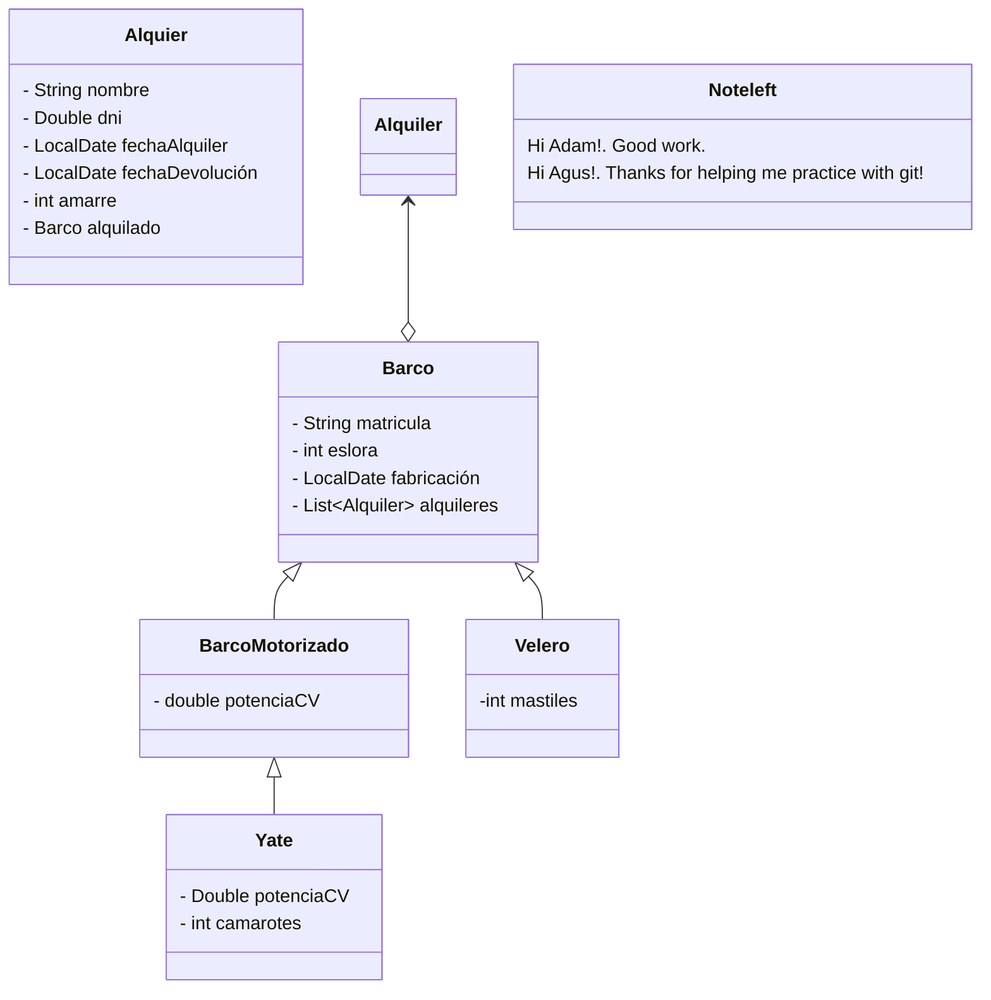

```mermaid
classDiagram
    class Alquier{
        - String nombre
        - Double dni
        - LocalDate fechaAlquiler
        - LocalDate fechaDevolución
        - int amarre
        - Barco alquilado
    }

    class Barco {
        - String matricula
        - int eslora
        - LocalDate fabricación
        - List~Alquiler~ alquileres
    }

    Alquiler <--o Barco


    class Yate{
        - Double potenciaCV
        - int camarotes
    }

    class BarcoMotorizado{
        - double potenciaCV

    }

    class Velero{
        -int mastiles

    }

    Barco <|-- BarcoMotorizado
    BarcoMotorizado <|-- Yate
    Barco <|-- Velero

Note left: Hi Adam!. Good work.

Note left: Hi Agus!. Thanks for helping me practice with git!
```
